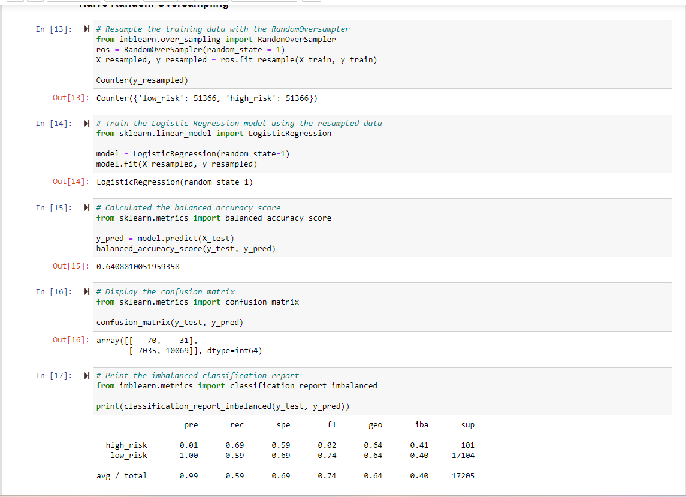
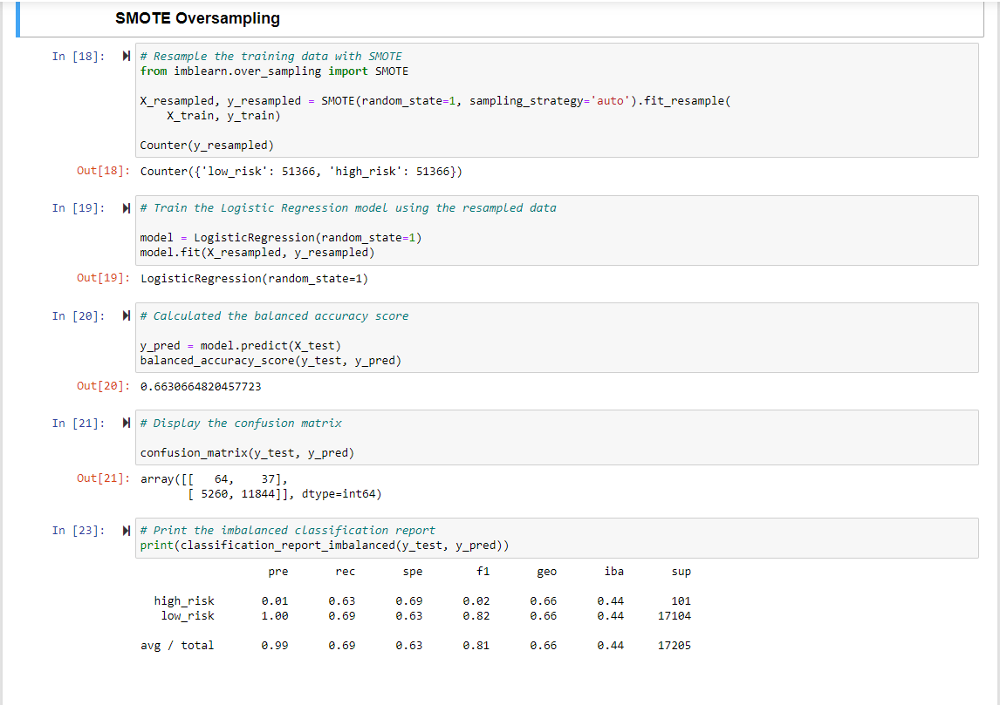
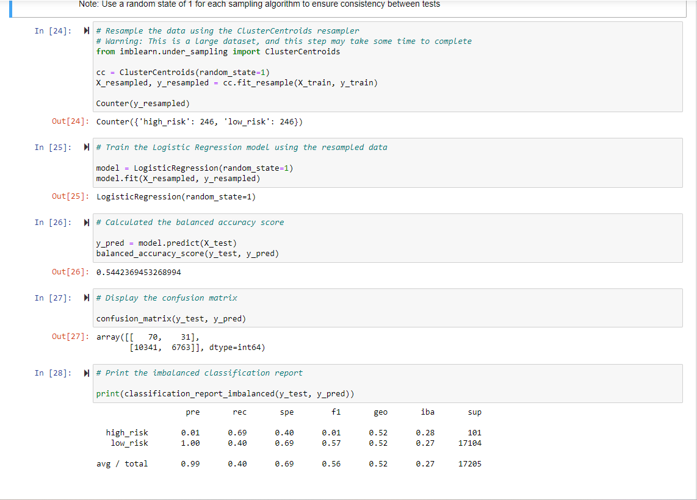
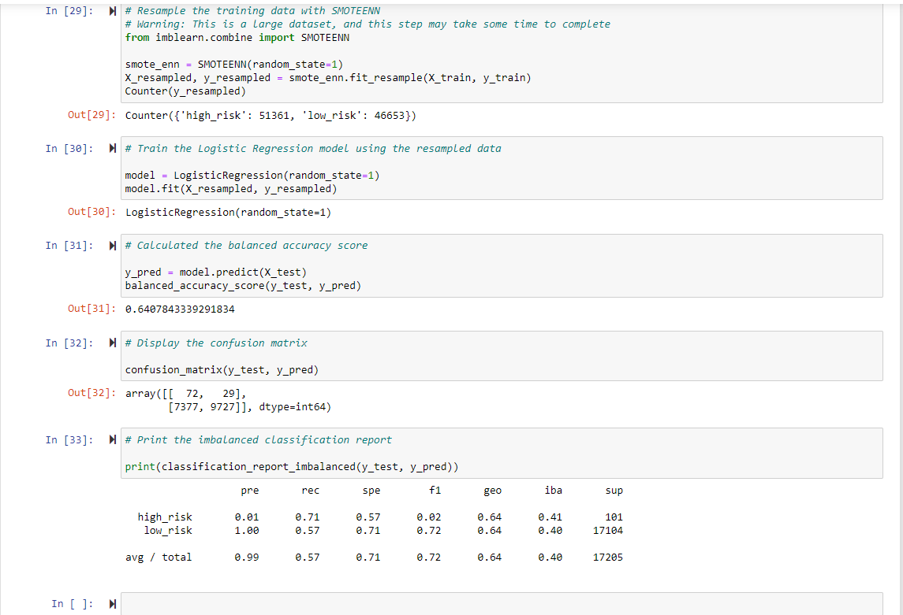
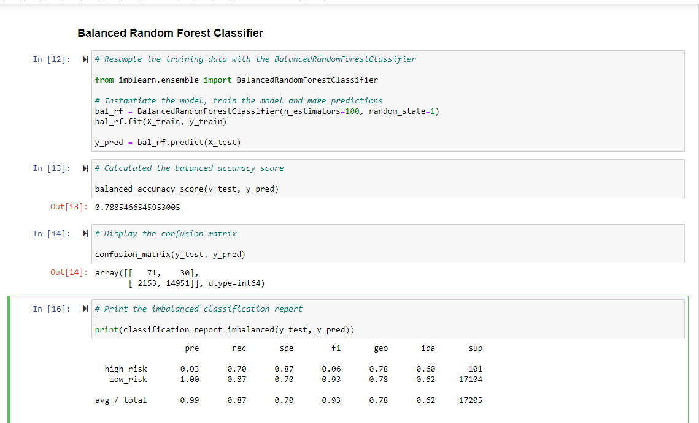
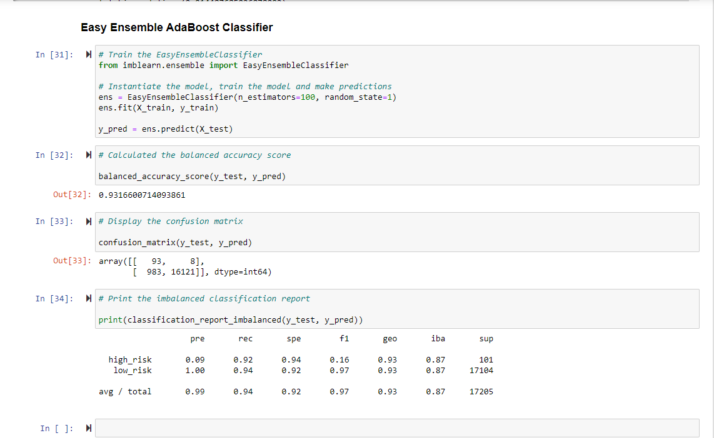

# Credit_Risk_Analysis

## Overview of the analysis

The purpose of the analysis is to use supervised machine learning techniques to solve a real-world challenge : credit card risk assessment. 

Credit risk is an inherently unbalanced classification problem, as good loans easily outnumber risky loans. Using the credit card dataset from LendingClub, a peer-to-peer lending services company, different techniques will be used to train and evaluate the model with unbalanced classes.

First, the data will be oversampled using 'Random Over Sampler' and 'SMOTE' algorithms, then undersample the data using 'Cluster Centroids' algorithm. Then a combination of over-and-under sampling will be used with the 'SMOTEENN' algorithm. Finally, 'Balanced Random Forest Classifier' and 'Easy Ensemble Classifier' is used to reduce bias and predict the credit risk. Then the performance of these 6 models will be compared to determine which model is better suited for credit risk analysis. 

## Results

<b> 1. Random Over Sampler </b>

*   Balanced accuracy score :   0.64
*   Precision : 0.01 for high_risk and 1.00 for low_risk 
*   Recall score :  0.69 for high_risk and 0.59 for low_risk
*   <b> F1 score : 0.02 for high_risk and 0.74 for low_risk </b>

    From the low precision and F1 scores for high_risk category, it can be concluded that this model is not good to predict high_risk credit assessment.

<b> 2. SMOTE (Synthetic Minority Oversampling Technique) </b>

*   Balanced accuracy score :   0.66
*   Precision : 0.01 for high_risk and 1.00 for low_risk 
*   Recall score :  0.63 for high_risk and 0.69 for low_risk
*  <b> F1 score : 0.02 for high_risk and 0.82 for low_risk </b>

From the low precision and F1 scores for high_risk category, it can be concluded that this model is not good to predict high_risk credit assessment.

<b> 3. Cluster Centroids </b>

*   Balanced accuracy score :   0.54
*   Precision : 0.01 for high_risk and 1.00 for low_risk 
*   Recall score :  0.69 for high_risk and 0.40 for low_risk
*   F1 score : 0.01 for high_risk and 0.57 for low_risk

From the low precision and F1 scores for high_risk category, it can be concluded that this model is not good to predict high_risk credit assessment.

<b> 4. SMOTEENN </b>

*   Balanced accuracy score :   0.64
*   Precision : 0.01 for high_risk and 1.00 for low_risk 
*   Recall score :  0.71 for high_risk and 0.57 for low_risk
*   F1 score : 0.02 for high_risk and 0.72 for low_risk

Although the accuracy score and F1 score for high_risk are slightly higher in this model, yet the precision and F1 scores for high_risk category is quite low. Hence it can be concluded that this model is not good to predict high_risk credit assessment.

<b> 5. Balanced Random Forest Classifier </b>

*   Balanced accuracy score :   0.79
*   Precision : 0.03 for high_risk and 1.00 for low_risk 
*   Recall score :  0.70 for high_risk and 0.87 for low_risk
*   F1 score : 0.06 for high_risk and 0.93 for low_risk

The accuracy score is higher in this model, as well as the precision and F1 scores for high_risk category are higher than the other models. Even so, as the F1 score is so low, it can be concluded that this model is not good to predict high_risk credit assessment.

<b> 6. Easy Ensemble AdaBoost Classifier </b>

*   Balanced accuracy score :   0.93
*   Precision : 0.09 for high_risk and 1.00 for low_risk 
*   Recall score :  0.92 for high_risk and 0.94 for low_risk
*   F1 score : 0.16 for high_risk and 0.97 for low_risk

The accuracy score is much higher in this model (0.93). The precision for high_risk category is 0.16 and the recall is 0.92. These numbers combined with the F1 score of 0.16, it can be concluded that this model is a good fit amongst all others to predict high_risk credit assessment.

## Summary

Looking at the F1 score, the precision and recall score as well as the accurancy for all 6 models, it can be concluded that the 'Easy Ensemble AdaBoost Classifier' is the best fit to predict high_risk credit assessments. Although the F1 score is not too high, the accuracy score is 0.93 which indicates that this model can correctly categorize the risk at 93%. The precision for high_risk is quite low (0.03) but the recall is 0.92 for high_risk which is highest amongst all the 6 models. This indicates that the model can correctly categorize high_risk at 92%. Hence the recommendation is to use the <b>'Easy Ensemble AdaBoost Classifier </b> model.
